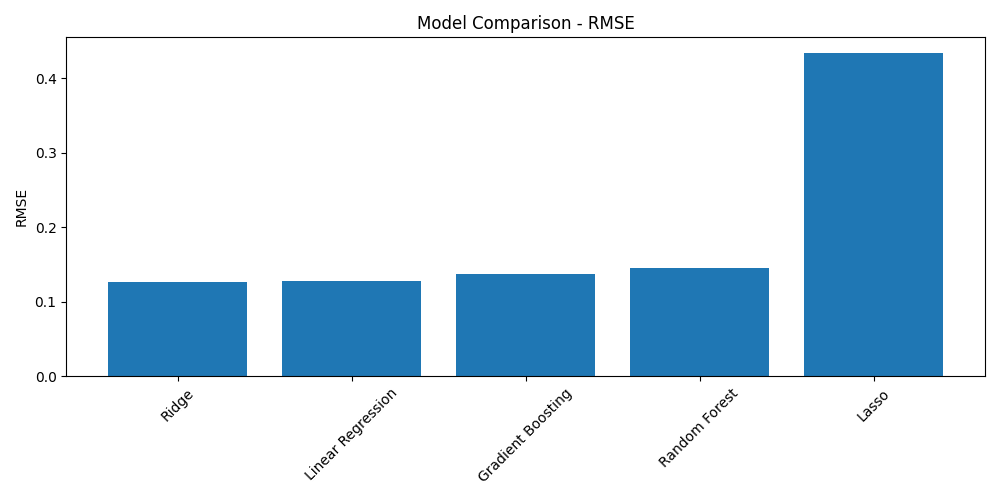

# House Price Prediction — End-to-End Data Science Project

## Project Overview

This project demonstrates a complete **end-to-end data science workflow** for predicting house prices using the Ames Housing dataset.



The goal of this project is to build machine learning models that can estimate the sale price of a house based on different property features such as living area, overall quality, garage size, and other housing characteristics.

The project follows a structured data science pipeline that includes:

* Data understanding
* Data cleaning and preprocessing
* Exploratory data analysis (EDA)
* Feature engineering
* Model training
* Model evaluation

This repository is designed to demonstrate practical data science skills and reproducible machine learning workflows.

---

## Dataset

The dataset used in this project is the **House Prices: Advanced Regression Techniques** dataset from Kaggle.

It contains detailed information about residential homes in Ames, Iowa, including numerous explanatory variables describing the houses.

Target variable:

SalePrice

The objective of the model is to predict this variable using the other available features.

---

## Project Structure

```

house-price-prediction

│

├── data
│   ├── raw
│   │   └── train.csv
│   │
│   └── processed
│       └── cleaned_train.csv

│
├── notebooks
│   ├── 01_data_understanding.ipynb
│   ├── 02_data_cleaning.ipynb
│   ├── 03_eda.ipynb
│   ├── 04_feature_engineering.ipynb
│   ├── 05_modeling.ipynb
│   └── 06_model_evaluation.ipynb

│
├── models
│   └── best_house_price_model.pkl

│
├── src

│
├── assets

│
├── requirements.txt

│
└── README.md
```
---

## Data Science Workflow

The project follows a typical machine learning workflow:

1. Data Understanding
   Initial inspection of the dataset structure, variables, and basic statistics.

2. Data Cleaning
   Handling missing values and removing features with excessive missing data.

3. Exploratory Data Analysis (EDA)
   Identifying relationships between variables and exploring the distribution of the target variable.

4. Feature Engineering
   Preparing the dataset for machine learning by separating features and target variables and building preprocessing pipelines.

5. Model Training
   Training multiple regression models using a consistent pipeline.

6. Model Evaluation
   Comparing model performance using multiple evaluation metrics and selecting the best-performing model.

---

## Machine Learning Models

Several regression models were trained and compared in this project:

* Linear Regression
* Ridge Regression
* Lasso Regression
* Random Forest Regressor
* Gradient Boosting Regressor

Each model was trained using a preprocessing pipeline to ensure consistent data transformation.

---

## Evaluation Metrics

Model performance was evaluated using the following metrics:

* Mean Absolute Error (MAE)
* Root Mean Squared Error (RMSE)
* R² Score

The model with the lowest RMSE was selected as the final model.

---

## Key Insights

Exploratory data analysis revealed several important features strongly correlated with house prices, including:

* Overall quality of the house
* Above-ground living area
* Garage capacity
* Total basement area

These variables showed strong predictive power for estimating house prices.

---

## Preprocessing Pipeline

A scikit-learn **Pipeline** was used to combine preprocessing and modeling steps.

Preprocessing includes:

* Median imputation for numerical features
* Most-frequent imputation for categorical features
* Standard scaling for numerical variables
* One-hot encoding for categorical variables

Using a pipeline ensures that preprocessing and modeling steps are applied consistently and reproducibly.

---

## Final Model

The best-performing model was saved for future predictions:

models/best_house_price_model.pkl

This saved model can be loaded later to generate predictions on new housing data.

---

## Technologies Used

This project was implemented using the following tools and libraries:

* Python
* Pandas
* NumPy
* Scikit-learn
* Matplotlib
* Seaborn
* Jupyter Notebook

---

## Future Improvements

Possible improvements to this project include:

* Hyperparameter tuning using GridSearchCV
* Cross-validation for more robust evaluation
* Feature selection techniques
* Model deployment using a web application

---

## Author

Amir Nasr Esfahani
